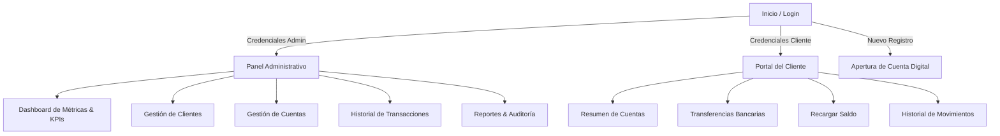

# 🏦 Banco Exprés - Sistema Bancario Digital

<div align="center">
  
  
  ### **Plataforma bancaria digital integral con arquitectura cliente-servidor, panel administrativo y portal de autoservicio para cuentahabientes.**
  
  [](https://reactjs.org/)
  [](https://nodejs.org/)
  [](https://www.mysql.com/)
  [](https://tailwindcss.com/)
  [](https://expressjs.com/)
  [](LICENSE)
  
  [📖 Documentación Técnica](docs/README.md) | [🐛 Reportar Bug](https://github.com/crxstiqn/Banco_Express/issues)
</div>

---

## 📋 Tabla de Contenidos

- [✨ Novedades Recientes](#-novedades-recientes)
- [🎯 Características Principales](#-características-principales)
- [🎨 Identidad Visual y Diseño](#-identidad-visual-y-diseño)
- [🏗️ Arquitectura del Proyecto](#️-arquitectura-del-proyecto)
- [🚀 Inicio Rápido](#-inicio-rápido)
- [👤 Roles y Credenciales](#-roles-y-credenciales)
- [📊 Módulos del Sistema](#-módulos-del-sistema)
- [📡 API Endpoints](#-api-endpoints)
- [📄 Licencia](#-licencia)

---

## ✨ Novedades Recientes

- 🌿 **Temática Verde Esmeralda Institucional**: Renovación estética unificada en base al color institucional (`#047857`, `emerald-600/700`), reflejada en el Login, Apertura de Cuentas, Dashboard Administrativo y Portal del Cliente.
- 🖼️ **Fotos de Perfil Reales y Dinámicas**:
  - Selector y visualizador inteligente de avatares en el botón circular del encabezado (`ProfileDropdown`) y en el menú contextual.
  - Asignación fotográfica automatizada para Administrador y Clientes (versión Hombre y Mujer) con respaldos visuales automáticos.
- 🔐 **Login Renovado y Limpio**:
  - Incorporación del logotipo oficial en el encabezado izquierdo.
  - Remoción de textos y elementos redundantes para una interfaz de acceso ágil, moderna y segura.
- 💳 **Módulo de Apertura de Cuenta**: Adaptación de estilo alineada a la nueva línea gráfica institucional.
- 📈 **Dashboards Mejorados**:
  - Tarjetas de métricas (KPIs) con acentos esmeralda y fondos refinados.
  - Gráficos de operaciones mensuales y botones de acción rápida con interacción visual pulida.

---

## 🎯 Características Principales

### 🔐 Seguridad y Autenticación
- **Autenticación con JWT**: Manejo de sesiones seguras mediante tokens con expiración de 24 horas y almacenamiento local sincronizado.
- **Control de Acceso Basado en Roles (RBAC)**: Enrutamiento y permisos segregados estrictamente entre Administradores y Clientes.
- **Cifrado de Contraseñas**: Algoritmo `bcrypt` para almacenamiento seguro de credenciales en base de datos.
- **Módulo de Auditoría**: Trazabilidad detallada de eventos, inicios de sesión y operaciones críticas.

### 💼 Operativa Bancaria Integral
- **Gestión de Clientes**: Altas, modificaciones, búsqueda por cédula/correo y estados (Activo, VIP, Inactivo).
- **Cuentas Bancarias**: Apertura digital, saldos en tiempo real, bloqueos y habilitaciones instantáneas.
- **Movimientos Financieros**: Depósitos, retiros y transferencias entre cuentas con actualización inmediata.
- **Portal de Autoservicio**: Clientes pueden consultar saldos, realizar recargas y efectuar transferencias de manera autónoma.
- **Notificaciones**: Sistema de alertas integradas para confirmación de transacciones y estados.

---

## 🎨 Identidad Visual y Diseño

El sistema implementa una estética moderna, limpia y bancaria basada en la paleta institucional:

| Elemento | Token / Valor Hexadecimal | Uso Principal |
|---|---|---|
| **Verde Esmeralda Primario** | `#047857` / `emerald-700` | Botones de acción, headers, badges y bordes activos |
| **Verde Esmeralda Interactivo** | `#059669` / `emerald-600` | Estados hover, elementos activos y KPIs destacados |
| **Acentos & Gradientes** | `#10B981` / `emerald-500` | Indicadores de estado activo, gráficos e iconos |
| **Fondos Clave** | `#F8FAFC` / `slate-50` | Fondos de superficie en modo claro |
| **Modo Oscuro** | `#0F172A` / `slate-900` | Superficies profundas con alto contraste |

### 📸 Avatares Asignados
Los recursos fotográficos se localizan en `public/img/foto de perfil/`:
- 👔 **Administrador**: `foto de perfil rol admin.png`
- 👨 **Cliente (Hombre)**: `foto de perfil rol cliente version hombre.png`
- 👩 **Cliente (Mujer)**: `foto de perfil rol cliente version mujer.png`

---

## 🏗️ Arquitectura del Proyecto

```
Banco_Express/
├── backend/                         # Servidor API REST (Node.js + Express)
│   ├── config/
│   │   └── db.js                   # Pool de conexiones MySQL
│   ├── controllers/                # Controladores de lógica de negocio
│   │   ├── authController.js       # Autenticación y registro
│   │   ├── clientsController.js    # Gestión de clientes
│   │   ├── accountsController.js   # Gestión de cuentas bancarias
│   │   ├── transactionsController.js # Procesamiento transaccional
│   │   ├── creditsController.js    # Simulaciones y créditos
│   │   ├── reportsController.js    # Generación de reportes
│   │   └── dashboardController.js  # Métricas agregadas
│   ├── database/
│   │   └── init.sql                # Esquema DDL y datos semilla
│   ├── middlewares/                # Autenticación JWT y validadores
│   ├── routes/                     # Definición de rutas REST
│   ├── services/                   # Auditoría y servicios auxiliares
│   └── server.js                   # Entrada del servidor backend
│
├── src/                            # Aplicación Frontend (React 18)
│   ├── components/
│   │   ├── Auth/                   # Login, Registro y Apertura de Cuentas
│   │   ├── Layout/                 # Header, Sidebar y Navegación
│   │   ├── Dashboard/              # KPIs, Gráfico de Operaciones y Acciones Rápidas
│   │   ├── Customer/               # Portal del Cliente (Resumen, Transferencias, Recargas)
│   │   ├── Clients/                # Módulo administrativo de Clientes
│   │   ├── Accounts/               # Módulo de Cuentas bancarias
│   │   ├── Transactions/           # Libro de Transacciones
│   │   ├── Credits/                # Gestión de préstamos y solicitudes
│   │   ├── Payments/               # Pasarela y pago de servicios
│   │   ├── Reports/                # Reportes analíticos y exportación
│   │   ├── Admin/                  # Registro de Auditoría
│   │   └── UI/                     # ProfileDropdown, Modales y Componentes reusables
│   ├── context/
│   │   ├── AuthContext.js          # Contexto global de sesión y usuario
│   │   └── BankContext.js          # Estado sincronizado del banco
│   └── utils/
│       ├── api.js                  # Cliente HTTP con inyección automática de token
│       └── avatarHelper.js         # Asignación dinámica de fotos de perfil
│
├── docs/                           # Documentación técnica modular
├── public/
│   └── img/
│       ├── logo/                   # Logotipo oficial del banco
│       ├── foto de perfil/         # Fotos reales de perfil (Admin / Clientes)
│       └── fondo/                  # Fondos gráficos
├── tailwind.config.js              # Configuración y tokens de diseño
└── package.json                    # Dependencias y scripts
```

---

## 🚀 Inicio Rápido

### 📋 Prerrequisitos
- **Node.js** 18.0 o superior
- **MySQL** 8.0 o superior
- **Git**

---

### 1. Clonar el repositorio
```bash
git clone https://github.com/crxstiqn/Banco_Express.git
cd Banco_Express
```

### 2. Configurar la Base de Datos
Ejecuta el script SQL en tu gestor de base de datos o consola MySQL:
```bash
mysql -u root -p < backend/database/init.sql
```

### 3. Configurar e Iniciar el Backend
1. Navega a la carpeta `backend`:
   ```bash
   cd backend
   ```
2. Crea el archivo `.env`:
   ```env
   PORT=5001
   DB_HOST=localhost
   DB_USER=root
   DB_PASS=tu_contraseña_mysql
   DB_NAME=banco_express
   JWT_SECRET=super_secreto_seguro_para_jwt
   ```
3. Instala dependencias e inicia el servidor:
   ```bash
   npm install
   npm run dev
   ```
   *El backend quedará escuchando en `http://localhost:5001`.*

### 4. Configurar e Iniciar el Frontend
En una nueva terminal, desde la raíz del proyecto:
```bash
npm install
npm start
```
*La aplicación abrirá automáticamente en `http://localhost:3000`.*

---

## 👤 Roles y Credenciales

El sistema ofrece experiencias adaptadas según el rol autenticado:

### 🟢 1. Administrador (Oficial Bancario)
- **Email:** `admin@bancoexpres.com`
- **Contraseña:** `admin123`
- **Capacidades:**
  - Control general del banco y monitor de operaciones en tiempo real.
  - Creación, modificación y bloqueo de cuentas y clientes.
  - Registro de transacciones en caja (depósitos / retiros).
  - Consulta de auditoría y reportes consolidados.

### 🔵 2. Cliente (Cuentahabiente Digital)
- **Email:** `usuario@bancoexpres.com` *(o cualquier usuario registrado desde el formulario de registro/apertura)*
- **Contraseña:** `usuario123`
- **Capacidades:**
  - Consulta de saldo actual y número de cuenta.
  - Transferencias inmediatas a otras cuentas de la entidad.
  - Recargas de cuenta en línea.
  - Historial detallado de movimientos propios.

---

## 📊 Módulos del Sistema



---

## 📡 API Endpoints

### 🔐 Autenticación
| Método | Endpoint | Descripción | Acceso |
|---|---|---|---|
| `POST` | `/api/auth/login` | Autenticación con email y contraseña | Público |
| `POST` | `/api/auth/register` | Registro de nuevos clientes | Público |
| `POST` | `/api/auth/change-password` | Cambio de contraseña | Autenticado |

### 👥 Clientes
| Método | Endpoint | Descripción | Acceso |
|---|---|---|---|
| `GET` | `/api/clients` | Listado general de clientes | Admin |
| `GET` | `/api/clients/email/:email` | Búsqueda de cliente por email | Admin / Cliente |
| `POST` | `/api/clients` | Registro de nuevo cliente con cuenta | Admin |
| `PUT` | `/api/clients/:cedula` | Actualización de datos del cliente | Admin |
| `DELETE` | `/api/clients/:cedula` | Desactivación de cliente | Admin |

### 💳 Cuentas
| Método | Endpoint | Descripción | Acceso |
|---|---|---|---|
| `GET` | `/api/accounts` | Listar todas las cuentas bancarias | Admin |
| `GET` | `/api/accounts/client/:id` | Cuentas asociadas al cliente | Propietario / Admin |
| `POST` | `/api/accounts` | Apertura de nueva cuenta bancaria | Admin / Cliente |
| `PUT` | `/api/accounts/:id/status` | Actualizar estado (Activa / Bloqueada) | Admin |

### 💸 Transacciones
| Método | Endpoint | Descripción | Acceso |
|---|---|---|---|
| `GET` | `/api/transactions` | Historial global de transacciones | Admin |
| `GET` | `/api/transactions/client/:id` | Transacciones del cliente | Propietario / Admin |
| `POST` | `/api/transactions` | Realizar depósito, retiro o transferencia | Autenticado |

---

## 📄 Licencia

Este proyecto está distribuido bajo los términos de la Licencia MIT. Consulta el archivo [LICENSE](LICENSE) para más detalles.

---

<div align="center">
  <p><strong>🏦 Banco Exprés - Innovación en Servicios Bancarios Digitales</strong></p>
  <p>Desarrollado para Banco Exprés • Cúcuta, Norte de Santander, Colombia</p>
  <p>
    <a href="https://github.com/crxstiqn/Banco_Express">⭐ Repositorio Oficial</a> •
    <a href="https://github.com/crxstiqn/Banco_Express/issues">🐛 Reportar Incidencia</a>
  </p>
</div>